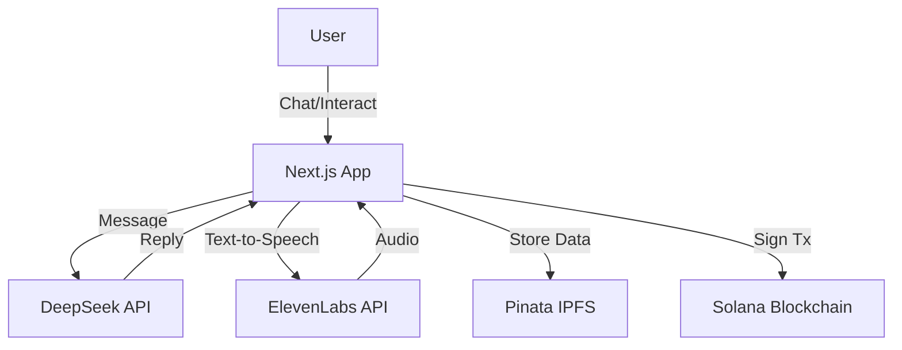

# 🎮 SolaMate - AI Companion & Social Hub on Solana

**SolaMate** is a next-generation social Web3 application built on Solana that combines financial management with an AI-powered pet companion. It reimagines the social experience by integrating intelligent interactions, decentralized storage, and seamless payments.

> **Core Philosophy**: Your Wallet is Your Identity. Your Pet is Your Companion.

## ✨ Key Features

### 🧠 AI-Powered Companion
Your pet isn't just a static image—it's alive!
- **DeepSeek Integration**: Pets have unique personalities (from "Tsundere Cat" to "Wisdom Dragon") and respond intelligently to your messages.
- **Voice Interaction (ElevenLabs)**: Your pet speaks to you using advanced text-to-speech technology.
- **Dynamic Mood**: Pet happiness and energy levels react to your financial habits and interactions.

### 🌐 Decentralized Storage
- **Pinata (IPFS)**: Critical application data and metadata are stored securely and permanently on the decentralized web using IPFS via Pinata.

### 🚀 Zero Friction Onboarding
- **No Registration**: Just connect your Phantom or Solflare wallet.
- **Privacy First**: No personal data collection. Your wallet address is your unique ID.

### 🤝 Social Connections
- **On-Chain Friendship**: Send and accept friend requests directly on the Solana blockchain.
- **Secure Chat**: Chat with friends with integrated payment commands (e.g., "Send 0.5 SOL to Alice").

### 💰 Expense Tracking (SolaSplit)
- **Automatic Recording**: P2P transfers are automatically recorded.
- **AI Classification**: Smart categorization of expenses (Dining, Bills, Entertainment).
- **Visual Analytics**: Interactive charts to track your spending habits.

## 🛠️ Technology Stack

### Frontend
- **Framework**: [Next.js 16](https://nextjs.org/) (App Router)
- **Styling**: [TailwindCSS v4](https://tailwindcss.com/) + Shadcn UI
- **AI & ML**:
    - **DeepSeek API**: For LLM-based pet personalities and chat.
    - **ElevenLabs API**: For high-quality AI voice synthesis.
- **Storage**:
    - **Pinata (IPFS)**: specific data storage.
    - **Firebase**: For real-time notifications and caching.
- **Web3**:
    - **@solana/web3.js**: Blockchain interaction.
    - **Anchor**: Client-side program interaction.

### Backend / Smart Contracts (Solana)
- **Framework**: [Anchor](https://www.anchor-lang.com/)
- **Language**: Rust
- **Program ID**: `ETsJTuFTVWRPW9xoMozFQxwuEpJXN3Z9xnWxdV7rcLcz`

## 🏗️ Architecture Design

### AI & Data Flow


## 🚀 Getting Started

### Prerequisites
- Node.js (v18+)
- Solana Wallet (Phantom/Solflare)
- API Keys for DeepSeek, ElevenLabs, and Pinata

### Installation

1. **Clone the repository**
   ```bash
   git clone https://github.com/yourusername/solamate.git
   cd solamate
   ```

2. **Frontend Setup**
   ```bash
   cd frontend
   npm install
   ```

3. **Environment Variables**
   Create `.env.local` in `frontend/` with the following:
   ```env
   # Solana
   NEXT_PUBLIC_SOLANA_RPC=https://api.devnet.solana.com
   NEXT_PUBLIC_PROGRAM_ID=<Your_Program_ID>

   # AI Services
   DEEPSEEK_API_KEY=your_deepseek_key
   ELEVENLABS_API_KEY=your_elevenlabs_key
   ELEVENLABS_VOICE_ID=your_voice_id

   # IPFS / Pinata
   PINATA_API_KEY=your_pinata_key
   PINATA_SECRET_KEY=your_pinata_secret
   PINATA_JWT=your_pinata_jwt

   # Firebase
   NEXT_PUBLIC_FIREBASE_API_KEY=...
   ```

4. **Run Application**
   ```bash
   npm run dev
   # Open http://localhost:3000
   ```

## 🗺️ Roadmap

- [x] **Phase 1: Foundation (MVP)**
    - Solana Contracts Deployment
    - Wallet Integration
    - Basic Pet System
- [x] **Phase 2: AI Integration**
    - DeepSeek Chat Integration
    - ElevenLabs Voice Support
    - Pet Personalities
- [x] **Phase 3: Social & Storage**
    - IPFS Storage via Pinata
    - Friend System
- [ ] **Phase 4: Advanced Features**
    - Pet Evolution & Skins (NFTs)
    - Mobile App
    - Mainnet Launch

## 📜 License

This project is licensed under the MIT License - see the LICENSE file for details.
