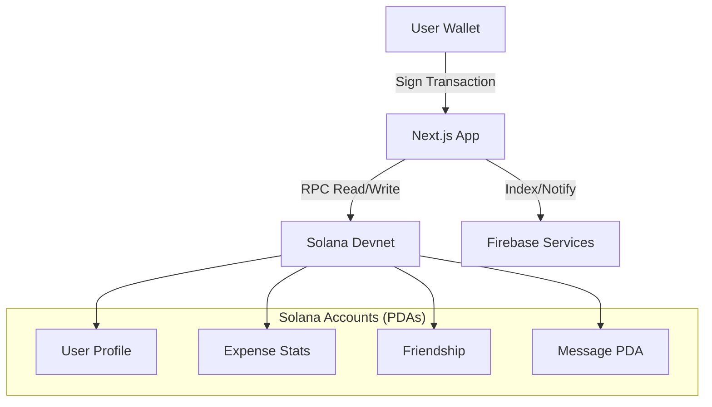

# 🎮 SolaMate - Connect & Play

**SolaMate** is a seamless Social Web3 application built on Solana. It reimagines the social experience by removing friction—no registration, no forms, no passwords. Your wallet is your identity.

> **Core Philosophy**: Connect Wallet = Start Playing.

## ✨ Key Features

### 🚀 Zero Friction Onboarding
- **No Registration**: Just connect your Phantom or Solflare wallet.
- **Privacy First**: No personal data collection. Your wallet address is your unique ID.
- **Instant Access**: Jump straight into the action in seconds.

### 🐾 Companion System (Pet)
Grow your digital companion through social interactions and financial activities.
- **10 Unique Pets**: From faithful Puppy to lucky Pig, each with unique XP bonuses.
- **Leveling System**: Level 1-10. Evolve your pet by sending messages, transferring SOL, and adding friends.
- **Interactions**: Feed and play with your pet to maintain Happiness and Energy levels.
- **Visual Identity**: Your pet appears next to your name across the platform.

### 🤝 Social Connections
- **Friendship (On-Chain)**: 
    - `Send Friend Request`: Creates a Pending friendship account.
    - `Accept Friend Request`: Updates status to Accepted.
- **Discovery**: Add friends via wallet address.
- **Status**: Real-time online/offline indicators (via Firebase).

### 💬 Secure Chat
- **On-chain Messaging**: Every message is a securely stored entry on the Solana blockchain.
- **Chat Rooms**: Automatically initialized PDAs between two friends.
- **Integrated Payments**: 
    - Type "Send 0.5 SOL to Alice for dinner".
    - AI Helper parses the intent -> Triggers wallet transaction.

### 💰 Expense Tracking (SolaSplit)
- **Automatic Recording**: Every P2P transfer is recorded in your `ExpenseStats` account.
- **AI Classification**: Smart categorization of expenses based on transaction description.
    - 🍽️ Dining
    - 🛍️ Shopping
    - 🎮 Entertainment
    - ✈️ Travel
    - 🎁 Gifts
    - 📄 Bills
- **Visual Analytics**: 
    - Interactive Pie Charts for category breakdown.
    - History filters (This Week, Month, Year).

## 🛠️ Technology Stack

### Frontend
- **Framework**: [Next.js 14](https://nextjs.org/) (App Router)
- **Styling**: [TailwindCSS](https://tailwindcss.com/) + [Shadcn UI](https://ui.shadcn.com/)
- **State Management**: React Query + Zustand
- **Wallet Connection**: Solana Wallet Adapter
- **Charts**: Recharts / Chart.js

### Blockchain (Solana)
- **Framework**: [Anchor](https://www.anchor-lang.com/)
- **Language**: Rust
- **Program ID**: `ETsJTuFTVWRPW9xoMozFQxwuEpJXN3Z9xnWxdV7rcLcz`
- **Architecture**: Monolithic `solamate_program` containing 3 modules:
    1.  **Social**: `UserProfile`, `Friendship`, `PetAccount`
    2.  **Chat**: `ChatRoom`, `Message`
    3.  **Expense**: `ExpenseStats`, `ExpenseRecord`

### Backend services (Hybrid)
- **Firebase**: 
    - Notification system.
    - User avatar and nickname storage (Rich metadata).
    - Search indexing.

## 🏗️ Architecture Design

### Data Flow


### Account Structures (Simplified)

**User Profile**
```rust
pub struct UserProfile {
    pub owner: Pubkey,
    pub pet_id: u8,
    pub friend_count: u32,
    pub created_at: i64,
}
```

**Expense Record**
```rust
pub struct ExpenseRecord {
    pub owner: Pubkey,
    pub amount: u64,
    pub category: ExpenseCategory, // Enum: Dining, Shopping...
    pub description: String,
    pub tx_signature: String,
}
```

## 🚀 Getting Started

### Prerequisites
- Node.js (v18+)
- Rust & Cargo (latest stable)
- Solana CLI (v1.18+)
- Anchor CLI (v0.29+)
- Phantom Wallet Extension

### Installation

1. **Clone the repository**
   ```bash
   git clone https://github.com/yourusername/solamate.git
   cd solamate
   ```

2. **Smart Contract Setup**
   ```bash
   cd solana-contracts
   # Install dependencies
   npm install 
   # Build contracts
   anchor build
   # Get your Program ID
   solana address -k target/deploy/solamate_program-keypair.json
   # Update declare_id! in lib.rs with your new ID if needed
   anchor test
   ```

3. **Frontend Setup**
   ```bash
   cd ../frontend
   npm install
   ```

4. **Environment Variables**
   Create `.env.local` in `frontend/`:
   ```env
   NEXT_PUBLIC_SOLANA_RPC=https://api.devnet.solana.com
   NEXT_PUBLIC_PROGRAM_ID=<Your_Program_ID_Here>
   NEXT_PUBLIC_FIREBASE_API_KEY=...
   ```

5. **Run Application**
   ```bash
   npm run dev
   # Open http://localhost:3000
   ```

## 🗺️ Roadmap

- [x] **Phase 1: Foundation (MVP)**
    - Solana Contracts Deployment
    - Wallet Integration
    - Basic Pet Selection
- [ ] **Phase 2: Social & Expenses**
    - Friends System (Requests/Accept)
    - P2P Chat
    - Expense Tracking Dashboard
- [ ] **Phase 3: Pet Evolution**
    - Leveling Logic (XP from transitions)
    - Pet Mini-games
    - Visual Evolution (Skins)

## 📜 License

This project is licensed under the MIT License - see the LICENSE file for details.

---

*Built with ❤️ for the Solana Renaissance Hackathon*
